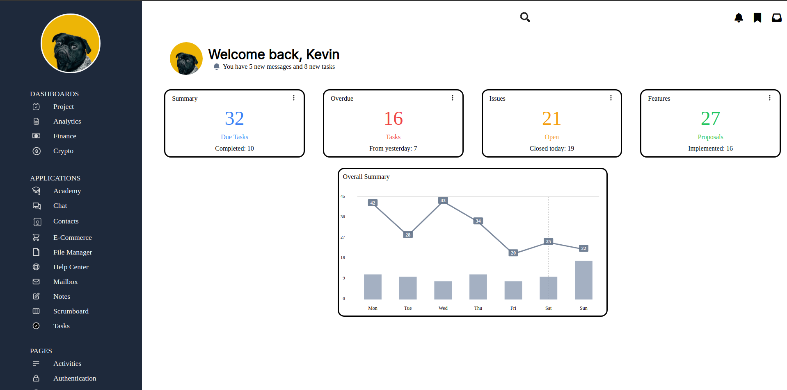

# Admin-Dashboard

Going through The Odin Project, I was tasked in using CSS Grid and Flex to make an admin page similar to a picture that was provided.

Without using JS (which is the next chapter), I decided to give this a try and see how well I could make an Admin page. 

I can see why developers use frameworks, especially after going through each element to make sure that they're all flexible and not breaking through each other (I wasn't perfect either, but will come back to this after I'm more proficient in JS)

Since this was more of a demonstration, a majority of the elements are not functional. But the design and outcome are very pretty and I'm proud of how well I did

:)

